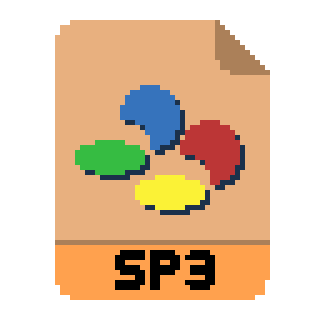

# SP3-Conv

A little web app that splits Stereo audio files into Mid/Side pairs, downsamples them and encodes them to BRR format.
The idea is to be able to play high quality audio on the SNES, encoding one song in each ROM, for use on stage as part of a set.
Using mid/side encoding instead of LR has the benefit of being able to put emphasis on the quality of the mono mid signal, while still retaining a convincing stereo effect via a lower quality side channel. This creates a perceptually higher quality sound than a normal LR recording at medium quality.

Right now it just generates the BRR files and allows you to preview the encoded audio. In the future, this will also create a ROM file complete with player and a waveform display.

# Thanks

Thanks to Optiroc, Kode54, nyanpasu64.... for their contributions to the [BRRtools](https://github.com/Optiroc/BRRtools) project, which the Javascript BRR codec heavily borrows from.
